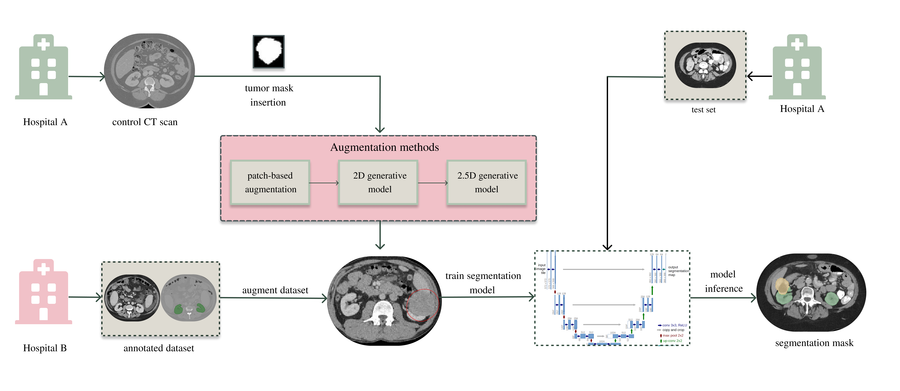
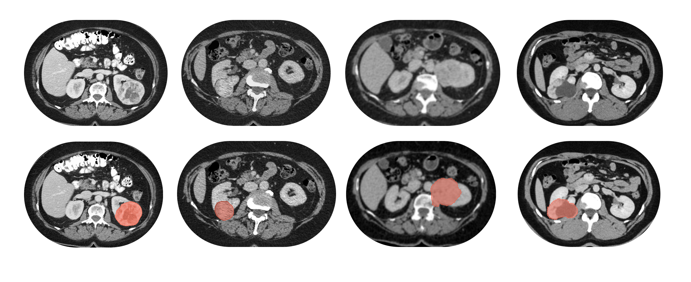
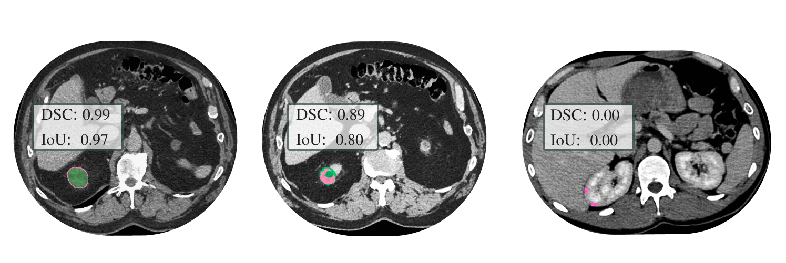

# Evaluating the Impact of Synthetic Data on Enhancing Kidney Tumor Segmentation in CT Scans

This project investigates how different synthetic data generation techniques influence the performance of medical image segmentation models, with a specific focus on kidney tumors in CT scans. The primary model used in this study is nnU-Net, a state-of-the-art framework for biomedical image segmentation.

This research was conducted as part of the undergraduate thesis of Anastasiia Petrovych, under the supervision of Dmytro Fishman.


## 🧠 Thesis Goal
To explore whether injecting synthetic kidney tumors into real CT scans can improve the accuracy and flexibility of segmentation models. The research examines:

* The effectiveness of various synthetic tumor generation methods
  
* Performance changes in nnU-Net models trained on augmented datasets
  
* Visual and quantitative evaluation of segmentation results


> Note: The repository contains one model's code and single sample dataset to comply with healthcare data privacy restrictions.


## 📁 Project Structure


```
.
├── data/                            # Metadata and filtered dataset information
│   ├── filtered_hospital_a_tumors.csv
│   ├── hospital_a_ct_scans_with_tumors.json
│   └── hospital_b_ct_scans_with_tumors.json

├── experiments/                     # nnU-Net preprocessed inputs, raw data, and training results
│   ├── nnUNet_preprocessed/
│   ├── nnUNet_raw/
│   └── nnUNet_results/

├── generation/                      # Synthetic data generation and analysis tools
│   ├── 2D_model/                    # Diffusion-based 2D tumor generation model
│   ├── 2.5D_model/                  # Multi-slice (2.5D) generation model
│   ├── Palette-Image-to-Image-Diffusion-Models/  # Palette diffusion framework
│   ├── copy_paste_augmentation/     # Copy-paste based tumor injection
│   ├── tumor_masks/                 # Extracted or generated tumor masks
│   ├── analyse_tumor_data.py        # Analyse tumor distribution and sizes
│   ├── augment_dataset.py           # Apply augmentations to CT datasets
│   ├── flip_ct_scans.py             # Flip scans to RAS orientation
│   ├── check_file_corrupted.py      # Check for corrupted CT or mask files
│   └── get_correctly_detected_tumors.py  # Evaluate tumor detection performance

├── segmentation/                    # nnU-Net training and inference scripts
│   ├── nnUNet/                      # nnU-Net framework
│   ├── train_model.bash             # Training model script
│   └── inference_model.bash         # Inference and evaluation script

├── visualisation/                   # Plots, overlays, and result visualizations

├── requirements.txt                 # List of Python dependencies
└── README.md                        # Project documentation
```


## How to start

1. Clone this repository to local environemnt.

2. Install Python requirements.
```bash
pip install requirements.txt
```

3. Train the model.

Send SLURM job.
```bash
sbatch segmentation/train_model.bash
```

Wait until the model is trained.

4. Run inference to get results.

Send SLURM job.
```bash
sbatch segmentation/inference_model.bash
```


### If you want to try generations:

Go to `generation/` folder.

If you want to run 2D model -> navigate to `2D_model/`.

If you want to run 2.5D model -> navigate to `2.5D_model/`.

If you want to run Copy-paste augmentation -> navigate to `copy_paste_augmentation/`.


## Solution

The proposed approach includes a systematic comparison between copy-paste augmentation and generative models, with a particular focus on diffusion-based methods. To address the problem of the limited amount of annotated data, we adopt multiple strategies: (1) optimal training-validation-test data splitting, (2) fine-tuning of pretrained models on new datasets, (3) copy-paste augmentation, (4) synthetic data generation using 2D diffusion models, and (5) synthetic data generation using 2.5D diffusion models. The results of every approach are validated, using standard segmentation metrics, on a held-out test set to ensure fair comparison and reproducibility.

The proposed pipeline, illustrated on Figure 1, provides an overview of all major components.


*Figure 1. Overview of the proposed pipeline. Real clinical data from Estonian hospitals A and B is used.*


### Copy-paste augmentation

The mostnaive approach togenerating synthetic data is thecopy-paste augmentation, which inserts real tumor patches, a 3D region containing the tumor and surrounding tissue, from annotated cases into "clean" CT scans from Dataset B. First, both the source and target scans are reoriented to a standard medical imaging orientation known as RAS (Right, Anterior, Superior), and resampled to match slice thickness along the axial axis. During resampling, interpolation is applied to adjust voxel spacing and ensure consistent resolution across volumes, which prevents inserted tumors from appearing or disappearing abruptly across slices, maintaining realistic anatomical continuity in the resulting CT scans.

For each extracted tumor patch we randomly select either the left or right kidney in the target scan as the insertion area. To guide realistic placement, we apply edge detection on a representative slice of the selected kidney, identifying its boundary. A point within the detected boundary is then randomly chosen as the initial placement location for the tumor to ensure correct position. The tumor is extracted from the source scan using the binary tumor mask and shifted to align with the selected kidney edge in the target scan. Further alignment is done along the z-axis to match anatomical depth if needed. The tumor is then inserted into the clean scan by overwriting voxel intensities in the target volume, and the segmentation mask is updated to include the corresponding tumor label. The result of this approach is shown by Figure 2.


*Figure 2. Comparison of original CT scans and synthetic tumor generation results. The top row presents the original scan with a tumor, the copy-paste augmentation output, the 2D diffusion model output, and the 2.5D diffusion model output. The bottom row shows the same scans with tumor regions highlighted in red for clarity.*


### Baseline Model Performance

As a starting point, a baseline nnU-Net model is trained on a combined dataset consisting of KiTS, KIRC, and the training part of Dataset A. Although Dataset A also includes a test set, in this setup the combined dataset is referred to as the source dataset, while Dataset B serves as the target dataset.
After training, the model is first evaluated on the testing set of Dataset A, achieving a DSC of 0.86 and an IoU of 0.81. Out of 99 tumor cases, 94 are correctly detected, with only 5 false positives among the 93 tumor-free scans. An example of the segmentation model’s predictions compared to ground truth annotations is shown in Figure 3.1.
To assess the model’s ability to generalise, it is also evaluated on the Dataset B Split I test set. The performance drops substantially here, with a DSC of 0.07 and an IoU of 0.06. The number of false positives increases to 80, and only 6 tumors are correctly detected.
These results support the core hypothesis of this research that a model trained on one data distribution does not necessarily generalise well to another. In this case,
Dataset B represents a healthier population with fewer pathological cases, contributing to the drop in segmentation accuracy and the rise in false positives. Furthermore, differences in CT acquisition parameters between the source and target datasets further widen the performance gap, emphasising the need for domain adaptation. A logical next step is to fine-tune the pretrained models on Dataset B to align them with the unseen data distribution better.


*Figure 3. Visual examples of segmentation results on CT slices of Dataset B. Green contours represent the ground truth tumor masks, and pink contours represent the model’s predictions. The pink area indicates a false positive if no green contour is present. DSC and IoU scores are provided for each case.*


## Summary of Results

The experimental results demonstrate that augmentation with synthetic data positively impacts model performance, providing slight improvements compared to other strategies. Neither optimal training-validation-test data splitting strategies nor fine-tuning alone leads to significant improvements across different settings. In contrast, models trained with synthetic data augmentation show better performance across different dataset configurations.
Although the observed improvements are minor, they demonstrate the potential of synthetic data augmentation, even with current limitations in the methods used. This suggests promising directions for future research. A detailed overview of all experimental results is provided in Table 1.


---

**Test Set Dataset A:** 192 CT Scans (99 with tumor lesions, 93 without tumors)

| Models                                                   | DSC ↑          | IoU ↑          | TP ↑           | FP ↓  |
|----------------------------------------------------------|----------------|----------------|----------------|-------|
| <u>Source-Only</u>                                       | <u>0.86</u>    | <u>0.81</u>    | <u>0.95</u>    | 0.05  |
| Target-Only                                              | 0.00           | 0.00           | 0.00           | 0.00  |
| Pretrained on Source + Finetuned on Target               | 0.00           | 0.00           | 0.00           | 0.00  |
| Source + Target (Joint)                                  | 0.82           | 0.77           | 0.92           | 0.09  |

---

**Test Set Dataset B Split I:** 143 CT Scans (15 with tumor lesions, 128 without tumors)

| Models                                                   | DSC ↑          | IoU ↑          | TP ↑           | FP ↓  |
|----------------------------------------------------------|----------------|----------------|----------------|-------|
| <u>Source-Only</u>                                       | <u>0.07</u>    | <u>0.06</u>    | <u>0.40</u>    | 0.63  |
| Target-Only                                              | 0.00           | 0.00           | 0.00           | 0.00  |
| Pretrained on Source + Finetuned on Target               | 0.00           | 0.00           | 0.00           | 0.00  |

---

**Test Set Dataset B Split II:** 100 CT Scans (6 with tumor lesions, 94 without tumors)

| Models                                                             | DSC ↑       | IoU ↑       | TP ↑        | FP ↓  |
|--------------------------------------------------------------------|-------------|-------------|-------------|-------|
| Source-Only                                                        | 0.06        | 0.06        | 0.67        | 0.62  |
| Target-Only                                                        | 0.00        | 0.00        | 0.00        | 0.00  |
| Pretrained on Source + Finetuned on Target                         | 0.00        | 0.00        | 0.00        | 0.00  |
| Source + Target (Joint)                                            | 0.07        | 0.06        | 0.67        | 0.51  |
| <u>Target-Only with Copy-Paste Augmentation</u>                    | <u>0.10</u> | <u>0.09</u> | 0.17        | 0.03  |
| Target-Only with 2D Diffusion Model Augmentation                   | 0.05        | 0.04        | 0.00        | 0.07  |
| Target-Only with 2.5D Diffusion Model Augmentation                 | 0.004       | 0.002       | 0.00        | 0.04  |
| <u>Source + Target (Joint) with Copy-Paste Augmentation</u>       | 0.09        | 0.08        | 0.67        | 0.37  |
| Source + Target (Joint) with 2.5D Diffusion Model Augmentation     | 0.08        | 0.08        | 0.67        | 0.44  |

---

*Table 1: Comparison of segmentation models’ results across different training datasets, strategies, and data augmentation methods.*
